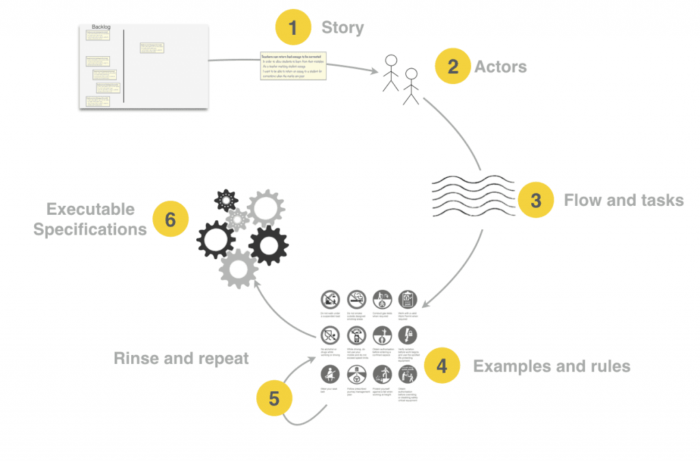

In my previous [post](http://blog.xebia.com/ubiquitous-domain-language-throughout-testing/), I discussed why we want to write software with [empathy](http://engineering.pivotal.io/post/abstraction-or-the-gift-of-our-weak-brains/) in mind; software that is understandable for peers. For us to create software with empathy in mind, we need to create a shared understanding of the users’ needs; the needs we are trying to satisfy with our software. Practices like [Domain Driven Design (DDD)](https://domainlanguage.com/ddd/) and [Behaviour Driven Development (BDD)](https://dannorth.net/introducing-bdd/) can help us achieve this. By using [Feature Mapping](https://johnfergusonsmart.com/feature-mapping-a-simpler-path-from-stories-to-executable-acceptance-criteria/) (a technique from BDD) and improving this with [Event Storming](http://eventstorming.com/) (a technique from DDD), we can create executable specifications and a model for our business needs at the same time. This way, we can write software and tests that match the shared understanding the business has, which enables us to ship more value faster.

<!--more-->

## Streetlight Effect

When agile teams start to engineer for requirements this mostly happens in refinements. The extent to which business analysts create functional designs up front is declining, and that is a good thing if we are working in complicated and complex environments: most developers simply won’t read big functional designs. Like Alberto Brandolini once said: “the only book that developers read, and is more than 50 pages, is Game of Thrones”.

A shared understanding and mindset of the business needs has to be available with Analysts, Domain Experts, Business, Testers, Ops and/or Functional Application Managers. We require domain knowledge crunching for this. There are some challenges to this, and the biggest problem I experience in teams is a form of observable bias called the “Streetlight Effect.”

A great example of the “Streetlight Effect” is the invisible gorilla. Most people might have seen the invisible [Monkey Business Illusion](https://www.youtube.com/watch?v=IGQmdoK_ZfY), where you need to count how many times the white shirt players throw the basketball at each other. During this video, a gorilla moonwalks through the screen, and 80% of the people will not notice the gorilla. The same [experiment](https://www.ncbi.nlm.nih.gov/pmc/articles/PMC3964612/) has been done with radiologists performing a familiar lung nodule detection task. 83% of radiologists did not see the gorilla. Scientists called this “inattentional blindness.”

## Deliberate Discovery

In an attempt to counter the “Streetlight Effect”, we want to use Deliberate Discovery as opposed to Accidental Discovery. Dan North explains the difference in a nice [blog post](https://dannorth.net/2010/08/30/introducing-deliberate-discovery/). Techniques coming from DDD and BDD can help teams to counter the “Streetlight Effect.” BDD techniques tend to focus more on the story and work towards executable specifications to be used in automated tests. DDD techniques, on the other hand, tend to focus more on modeling the software that we build. Both the DDD world and the BDD world have some overlap in these techniques, but I rarely come across a situation where these two worlds are combined.

Feature Mapping (developed through BDD) and Event Storming (developed through DDD) are both great techniques whose outcome we can use to go straight to our software code and test code. This helps us to create code that matches the shared understanding of our team: the mental model. Code that represents the mental model of our team is effective as it will infer less miscommunication and act as living documentation. For instance, new developers in our team can go through the code and get a good sense of what the domain is about. As a result, the timeframe in which a new developer will become productive is shortened, as the code is more comprehensible. If there is a bug in a system reported by someone from the business, the developer can easily match the language used by the business with the code, and solve the bug much faster. Although the initial effort will be high, productivity is increased and this technique contributes to ship more value faster.

## Improving Feature Mapping with Event Storming

If we look at Feature Mapping by John Smart, it focuses on a simpler path from user stories to executable acceptance criteria (see the figure below). This technique helps us to bring the domain language to our test code and gives a good knowledge of the business process. We want to listen to ‘real-life stories’. Most important is getting these stories from stakeholders first hand. We want to know the purpose of the story. We want to experience it. Out of the story, we discover and write down the actors, the flow plus tasks, the examples plus rules and then go to executable specifications. The story that is told seldom changes. The rules might change (e.g., an online retailer may change the shopping basket value threshold for free shipping), but the purpose stays the same. If the purpose changes it will probably be a different story.

What is missing in Feature Mapping is modeling the purpose. You can create and explore different models for the same purpose. A model can even change while the purpose stays the same. There is no perfect model, all models are wrong. A model is an abstraction of the reality that is fit for the purpose, but an abstraction will always be flawed. So if we get more stories for the same purpose, the model that we use may become useless. So, we need to adapt and find new models that will be fit for the new stories. Event Storming is a technique created by Alberto Brandolini that focuses on creating models out of the flow and tasks of the story. In this technique, we can create different models. Combining Event Storming with Feature Mapping is really powerful because you have both your examples and your model visualised. This way we can keep refining our model based on our examples. Because if all models are wrong, we want to let go of concepts and models that do not fit, as we need the ability to “[kill our darlings](https://thewritepractice.com/kill-your-darlings/)“. Especially when we use a model for some time, this can be really hard because we can get attached to the model. This is one of the biggest challenges in designing software.

## A running example

### The User Story and the Actors

Let me show you an example. Let’s say we have the user story of buying tickets for the theater. Following Feature Mapping, we start with step 1, telling the story of buying a ticket for the theather. The business analyst, for instance, will start explaining what the need and purpose are of this story. We just listen at this point as the analyst explains the story and tells ‘real-life stories’.

Then for step 2, we will describe the Actors:

- The Customer buys a ticket.

- The Theater sells the tickets.

Don’t worry too much about getting this one right, we can always change them.

### Event Storming

Now for step 3 it is time to start Event Storming. Event Storming has five important concepts:

Command (Blue): Decision or action.

Aggregate (Yellow): Local Logic

Event (Orange): Domain Event

Policy (Lilac): Reactive Logic (Whenever), Listener, Process Manager, Saga.

Read Model (Green): Key Information

The basic Event Storm flow is: Command -> Aggregate -> Event -> Read Model or Policy.

If you want to know more about these concepts, I would recommend you to read the book about [Event Storming ](http://eventstorming.com/)or attend a Workshop Event Storming. I will not go into too much detail about Event Storming, but just enough for you to follow along.

So we start to Event Storm a naive flow for ordering movie tickets without defining the Aggregate yet. First, write down the outcome as an Event and try working from the start of the flow towards that event.

The most important part about this is that any discussion needs to be visualized, either by Event Storming or just by drawing pictures. When we are Event Storming, we usually start by giving examples. These examples should be written on a green sticky note and be placed on the left side of your Event Storming. We can start giving our Aggregates a name. It can happen that multiple models already start emerging here; put them beneath or next to the other one.

### Examples and Rules

The next step is step 4; for now, we will use [Example Mapping](https://cucumber.io/blog/2015/12/08/example-mapping-introduction) to keep it simple. The aim is to get as many examples as possible.  If you want to go deeper and create a Feature Map that would be the best! You can read more about going deeper at the post about [Feature Mapping](https://johnfergusonsmart.com/feature-mapping-a-simpler-path-from-stories-to-executable-acceptance-criteria/).

When we are done, we want to pick out one or two rules with the scenarios that are most important and leave the other ones only in the back of our minds. It is time to go back to our Event Storm and check if our model is good enough to run the examples through. At this point, multiple branches and flows will start to emerge. This gives you the opportunity to see your model from different angles and create other models. You will probably see the same Aggregates in the same flow. The time has come to let go of the flow and start building towards modeling our Aggregates trough state-machines.

## From outcome to code

As you can see from the last picture, we created examples and models and made them visual. From this outcome, we can develop software based on our model and executable specifications based on our examples. The commands in an Event Storm represent the tasks in the Feature Map. We can use these to create the flow for our executable specification. By doing this we create a true ubiquitous language and mindset that is represented in our code. Just by going through the executable specification and the model in the code, we can get a sense of the purpose of the system. Moreover, it will match the way the business will think and talk. We will ship more value faster!

If you want to know more about this, feel free to contact me for a training in BDD or DDD.

If you want to see the slides of the talk I have at DDD Europe 2018 about this subject, go [here](https://speakerdeck.com/baasie/domain-language-throughout-tests-combining-ddd-and-bdd).

In the next post, I will show you how you can use the outcome and start implementing this directly into your code using Test Driven Development.

Also, this post is published on the blog of [Xebia](http://blog.xebia.com/combining-domain-driven-design-and-behaviour-driven-development/)
