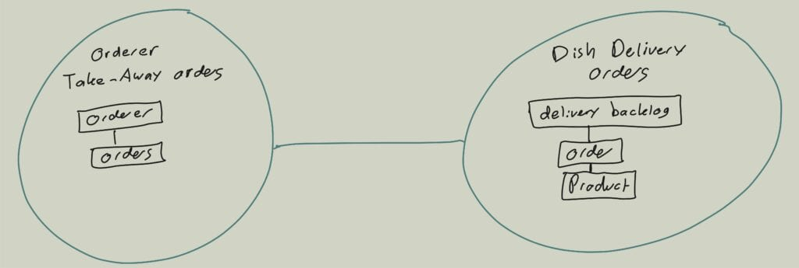
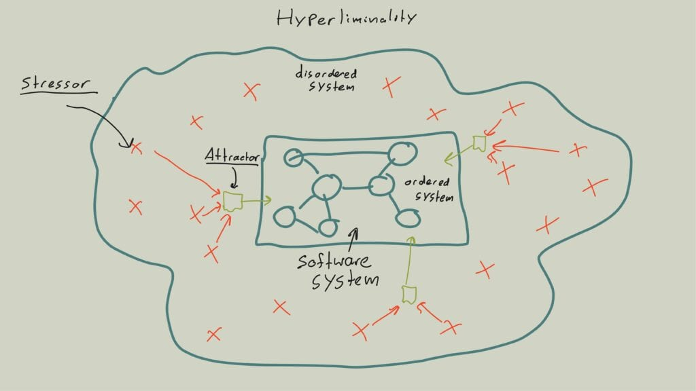
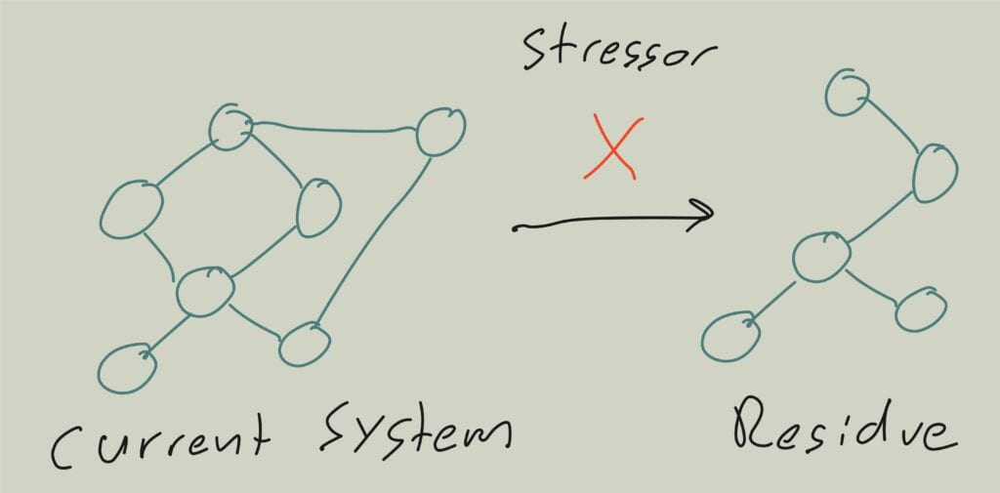
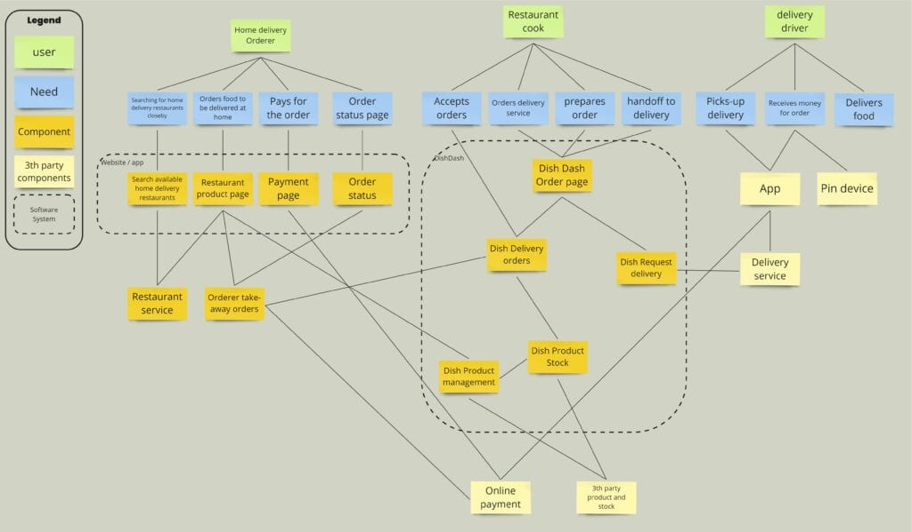
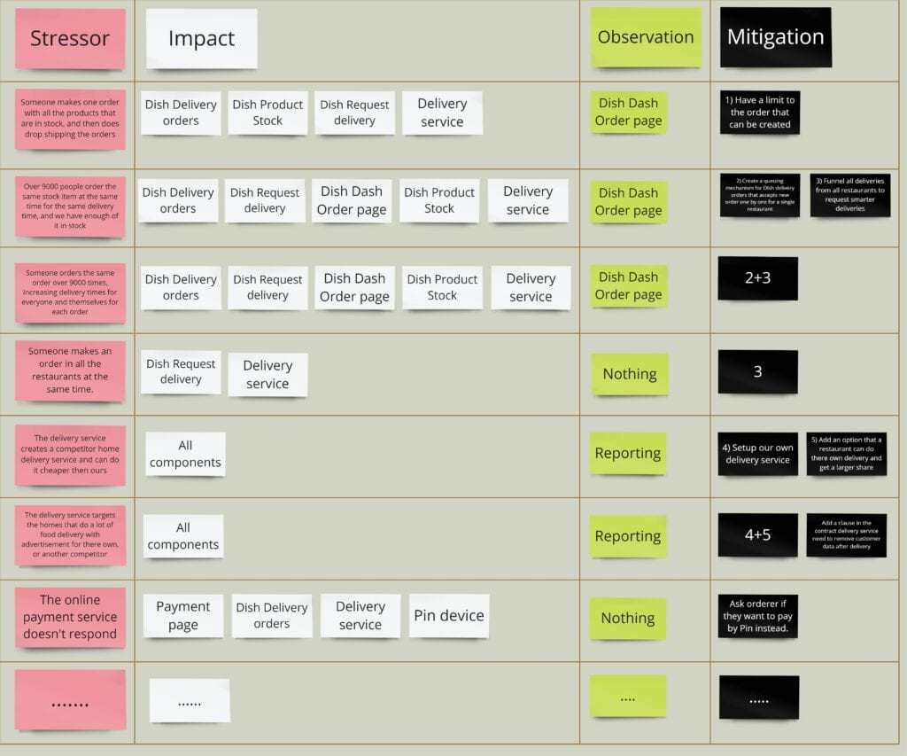

Domain-Driven Design (DDD) provides a valuable framework for addressing complex business problems through well-designed domain models integrated into software systems. Central to this approach is the concept of bounded contexts, serving as models tailored to solve specific user or business challenges within a shared ubiquitous language. Yet, distilling these bounded contexts can be a formidable challenge, as there is no one-size-fits-all path to defining what makes a “good” design.

The notion of “good” design involves not only effectively solving the business problems but also ensuring adaptability and resilience in the face of uncertain future changes. This challenge arises because we use DDD primarily with complex business problems where the unknown prevails, and cause-effect relationships can only be discerned in hindsight. In this blog post, we delve into Residuality Theory by Barry O’Reilly, offering a pragmatic and scientifically grounded approach to designing bounded contexts. Residuality Theory, in my experience, has been a game-changer in how we architect software systems. I’ve applied it extensively with clients over the past year, and I hope this post inspires and helps you to explore its potential impact in your own software design endeavours.

## Why do we design bounded contexts?

Have you ever been approached by a domain expert explaining their needs concerning a complex business problem they’d like to see addressed within the current software system? However, when you delve into the code, you find it hard to correlate most of what they said to the actual code. Sure, you could identify a few nouns, which are related to other nouns that seem abstracted from reality. These objects often perform functions that appear disconnected from the business problem under discussion. Furthermore, logic related to the business problem is already part of the system, assuring you that it indeed needs to be built into this software. Yet, comprehending how it all fits together remains elusive. And changing one part of the code, might intersect with other teams or different related business problems, giving you lower autonomy in the code.

> “If the design, or some central part of it, does not map to the domain model, that model is of little value, and the correctness of the software is suspect.” — ― Eric Evans, Domain-Driven Design: Tackling Complexity in the Heart of Software

That is why Eric Evans came up with the bounded context pattern, a central concept in Domain-Driven Design (DDD). At its core, a bounded context is a model designed to solve a specific user/business problem, bounded within a ubiquitous language. Let us break this down, the “model designed to solve a specific problem” implies that we design a model to handle the complexity inherent to a distinct business or user challenge. By encompassing various elements of a domain, the model simplifies the design process and enhances understanding of the system.

The term “ubiquitous language” refers to a consistent and clear language designed specifically for the model. This language forms a sphere wherein the domain model’s language, terms, and rules maintain consistency. Importantly, this language is designed collaboratively with domain experts. The concept and jargon is typically derived from what the domain expert uses, but will collaboratively be cleaned up and improved upon to have sharper and narrower definitions.

The principal aim of a bounded context is to isolate the complexity of the model and avoid confusion or inconsistencies that could arise when different models interact. A crucial point to note is that if your domain experts aren’t aware, or you did not collaboratively design the bounded context, its model, and its language, then it isn’t truly a bounded context and doesn’t align with Domain-Driven Design (DDD). It is a linguistic boundary and collaborative pattern.

In this post, I’ll use an example from the online food delivery industry. Let’s consider the core value stream of our business where an Orderer is making an order, the restaurant cook is creating that order and sends it off to the delivery driver to deliver the order. When an Orderer makes an order we might handle that in a bounded context, possibly titled ‘Orderer Take-away orders.’ Where we are fulfilling the need of that ordererer to find and make the best order for their needs.

Now, when we consider the customer journey of creating an order for a restaurant cook, we might handle that in a separate bounded context, possibly titled ‘Dish Delivery orders.’ Where we are fulfilling the need of a cook to know if we can prepare that order. Both of these contexts might use the term Order.’ However, the term’s meaning varies between contexts. In ‘Orderer Take-away orders,’ an ‘order’s’ responsibility is to give information about the order they made and whether possible they can cancel it based on business rules or constraints. In ‘Dish Delivery orders,’ an ‘order’s’ responsibility pertains to the order that is being prepared by the restaurant cook, and what products they need to make and what dietary restriction that person might have for the order . This design is further illustrated in the following context map:

> In a conversation with Nick Tune on LinkedIn about this article, he finds Zhamak’s explanation of [Polysemy ](https://en.wikipedia.org/wiki/Polysemy)in her [Data Mesh book](https://martinfowler.com/articles/data-mesh-principles.html) to be simpler and easier to grasp when we talk about the same entity in different contexts.

As you can see in the figure, we now have two bounded contexts in our context map. And these two bounded contexts are connected with each other. In this case, Orderer Take-away orders needs Dish Delivery orders to make sure that the order is actually being prepared. The context map is great at assessing or giving us an overview of how these bounded contexts interact with each other.

## Why is designing Bounded Contexts hard?

Up until now, I’ve presented a rather focused context map consisting of just two bounded contexts. However, in an organisation such as in the online food delivery business, there exist numerous business and user challenges that extend beyond what the team building the ‘Dish Delivery orders’ bounded context might be aware of. These additional challenges could influence the design of a bounded context.

Remember, a bounded context is essentially a model — a simplified, abstract representation of reality with a specific purpose: to solve our problem. For many business problems, especially the more complex they are, there are multiple ways to model the solution, each with its own set of trade-offs.

Domain modellers typically employ a range of collaborative modelling exercises like Business Model Canvas, Wardley Mapping, Domain Storytelling, Eventstorming, Example Mapping, Domain Message Flow Modeling, and Context Mapping. These methods allow us to view and model the problem from different angles, progressively discovering, distilling, and designing bounded contexts based on our current understanding. The more complex a problem is, the more we collaborate with stakeholders to grasp their challenges, which subsequently shapes our design. More on this can be found in the book ‘[Collaborative Software Design](https://weave-it.org/book-collaborative-software-design/),’ which I’m co-authoring with Gien and Evelyn.

The real challenge arises when dealing with complex problems. These exist in a system where cause-effect relationships can only be determined after the fact, not beforehand. Such problems call for exploration and experimentation to unearth patterns and solutions, rather than relying on pre-established best practices or analyses. This implies we are dealing with the unknown when we design. Hence, we extensively use collaborative modelling exercises to probe our bounded context design. This also underscores why DDD proves more valuable when addressing complex problems. For a better grasp of complexity, I recommend reading up on the Cynefin framework. A great starting point for those in IT would be Liz Keigh’s blog, ‘[Cynefin for Everyone.](https://lizkeogh.com/cynefin-for-everyone/)‘

## How do domain modellers deal with complex problems?

While designing bounded contexts for complex problems, domain modellers utilise their collection of implicit or explicit design heuristics. Heuristics, by definition, are plausible aids or directions that guide the problem-solving process, but they ultimately remain unjustified, impossible to fully validate, and prone to errors. These heuristics become vital when we deal with complex problems because, as stated earlier, cause-effect relationships can only be discerned in hindsight.

> We all use heuristics (even if we haven’t articulated them to others) to discover, understand, explore, create, modify, or extend complex software systems. Billy Vaughn Koen, in Discussion of the Method: Conducting the Engineer’s Approach to Problem Solving, defines a heuristic as, “anything that provides a plausible aid or direction in the solution of a problem but is in the final analysis unjustified, incapable of justification, and potentially fallible. — ― Rebecca Wirfs-Brock

It’s crucial to note that we all use these heuristics, even subconsciously. A skilled domain modeller not only recognizes the heuristics they personally employ, but also extracts heuristics from the group with which they’re designing. It’s important to isolate and refine these heuristics to make more informed decisions. A common practice in Domain-Driven Design (DDD) is to design at least three different bounded context models. Using the heuristics, we can carry out a trade-off analysis, make informed decisions, and document these in the architecture decision record. Our upcoming book provides a more detailed guide on this process.

However, there’s an inherent problem here: we often rely excessively on the domain modeller’s experience, gut feeling, and the group’s available heuristics. If we’re truly honest with ourselves, this approach isn’t particularly scientific, is it?

## How does residuality theory impact domain modelling?

Indeed, Barry M. O’Reilly grappled with the same question. I attended a three-day advanced software architecture course where he introduced the concept of residuality. Barry was given the task of training junior software architects to approach software architecture as he did. But, he found himself asking, “How exactly do I approach software architecture?” He discussed this with other senior software architects, only to discover that they largely relied on gut feeling. Though they were designing resilient software architectures capable of withstanding an organisation’s complexity, nobody could articulate how they achieved it, much less provide scientific proof. This led Barry to undertake PhD research and develop the residuality theory.

So, what exactly is Residuality Theory? It’s a broad and intricate theory; my three-day training was merely an introduction to its application. I won’t delve too deeply into it in this blog post, but I can recommend a comprehensive introduction via this [virtual Domain-Driven Design recording](https://www.youtube.com/watch?v=ZAoHBOVgmr4). The essential takeaway for this post is that Residuality Theory provides a basis for designing software systems with resilient and antifragile behaviour through understanding sensitivity to stress and the concept of residual behaviours.

A fundamental idea in this theory is Hyperliminality 1, which is an ordered system inside a disordered system. An ordered system is predictable, mappable, and testable. A disordered system is dynamic, growing, and unpredictable. The architect is forced to constantly move between these two worlds, with ordered software and disordered organisation contexts which require entirely different tools and epistemologies to understand.

Our software systems are ordered systems which in essence are predictable, mappable and testable. It operates in our organisation which is a disordered system. We cannot predict what will happen in that organisation and the market it is operating in. When we design a bounded context we are forced to work towards an unknown future. Any event that arises in that unknown future, which the system is not designed for, is known as a stressor2 as shown in the following figure:

The first thought that comes to mind is that we often organise collaborative modelling sessions with domain experts to discover any unknown factors. Techniques like Example Mapping, Domain Storytelling, and Eventstorming are excellent for discovering these stressors. However, these methods are typically focused on the problem at hand, which may limit our thinking due to functional fixedness and framing bias. Functional fixedness is a type of bias that restricts us to only thinking about familiar concepts. Framing bias, on the other hand, refers to how the presentation of information can influence our views. Barry suggests that probability significantly influences our decisions in these sessions. This means if we think an issue is unlikely to occur, we might decide not to include it.

Our designs might lose resilience due to cognitive biases and our judgments about the probability of certain events. It’s important to remember that we can’t predict everything in a complex system. By considering and discussing various unexpected issues that we might usually overlook, we increase our range of possibilities, which should lead to more resilient designs.

These stressors all lead to something called an attractor, a limited number of states in the network’s state space to which the system will repeatedly return3. There is more to unfold about attractors, which were demonstrated by Kaufmann networks in 19694. You can read about it in Barry’s article ‘Residuality Theory, random simulation, and attractor networks’ .Different stressors may lead to the same attractor that affects our system. Even a stressors that seems irrelevant, and which we might disregard due to its low likelihood, could end up impacting the system in the same way as a stressors that we didn’t foresee, but it is very likely to happen.

This is why considering such ‘unlikely’ stressors is essential. It helps us in creating more resilient software design that can adapt to unexpected events. This capacity for a system to reshape itself under unforeseen circumstances is what we call ‘criticality’. Criticality can be quantified by looking at the number of components in the software and the number of connections between these components. We’ll delve into this topic further in a future blog post. For now, understanding the potential impact of stress in Hyperliminality is the key takeaway.

- Residuality Theory, random simulation, and attractor networks – Barry M O’Reilly ↩︎

- Residuality Theory, random simulation, and attractor networks – Barry M O’Reilly ↩︎

- Residuality Theory, random simulation, and attractor networks – Barry M O’Reilly ↩︎

- Residuality Theory, random simulation, and attractor networks – Barry M O’Reilly ↩︎

## Collaborative modelling stressors for residues

We’ve already touched on the significance of Domain-Driven Design in software architecture and the essential role of Residuality in crafting resilient software systems. But how do we embed residuality theory in our Domain-Driven Design approach?

In Hyperliminality, there are a few givens. There is always a current state. Then, we know a future change occurs due to a stressor, which transitions the current state into a new one. This new state is referred to as the ‘residue’. Through stressor analysis, we can simulate a variety of random stressors to observe the patterns they create. This helps us predict potential ‘residues’, or new states, arising from these stressors.

The first thing to determine in our approach is the current state of our system. We may already have parts of this information in the form of C4 models or a context map. If not, we can begin with collaborative modelling sessions using bite-sized architecture or by distilling the context map from a Big Picture Eventstorming.

However, these models and maps often focus primarily on the software system. We also need to understand the larger disordered system in Hyperliminality — all the elements we can identify that interact with our software. A helpful tool for this is value chain mapping, as done by Wardley Mapping. This method requires an understanding of our business. If that’s missing, you might want to create a business model canvas with stakeholders or conduct a Big Picture Eventstorming session if you can gather a lot of them together.

After understanding the broader context, the next step is to drill down from the users’ perspective, their needs to your software architecture. The folks at Team Topology provide an explanation for this in their ‘[User Needs mapping](https://teamtopologies.com/key-concepts-content/exploring-team-and-service-boundaries-with-user-needs-mapping)‘ approach. It’s important to remember, though, that these examples are depicted as simplistic. In reality, you may face more chaos and complexity when conducting these sessions.

In this scenario, bounded contexts are modelled as components grouped within the software systems where they are deployed. Yet, these software systems can also be represented as components within the value chain. The way you visualise the software architecture depends greatly on your preferences and what you’re aiming to model, particularly if a context map is already in place.

Understanding the current situation sets the stage for designing a software system based on new needs. It’s worth noting that you don’t have to wait for a specific need for change to use Residuality Theory; it can be applied to existing systems as well. Designing software often becomes more straightforward when there is a clear business need, which not only motivates the design but also ensures its actual implementation. Nevertheless, applying Residuality Theory can reveal weaknesses in your current design, which could prompt necessary changes in business strategy.

## Designing bounded contexts with stressor analysis

Now we can do a collaborative stressor analysis on our naive software design. This tool from Residuality Theory is designed to identify the stressors, understand how it impacts the architecture, determine ways to detect it, and come up with mitigation for the stressor. There are two approaches to this: one is to brainstorm as many potential stressors as you can think of and then start to define the impact, how to observe it is happening and the mitigation per stressor. Alternatively we can start with a single stressor, define the impact, how to observe the stressor is happening and the mitigation, and allow additional stressors to emerge organically.

Personally, I prefer the former approach, identifying all potential stressors first, and then assessing each one individually. It’s important to keep in mind that new stressors may surface as you delve deeper into the analysis of each one. Another important aspect is that if you cannot think of a lot of stressors, then probably you are not dealing with a complex system.

Let’s consider an example relevant to a food delivery: imagine someone makes one order with all the products that are in stock, and then does drop shipping the orders. This scenario would impact Dish Delivery orders, Dish Product Stock, Dish request Delivery and the delivery service. We could detect this trend through the Dish Dash order page. A potential mitigation strategy might be to have a limit to the order that can be created. You can look at an example stressor analysis here:

Now, we can identify patterns in mitigating stressors. Are there recurring mitigations? Such patterns are likely effective against future, unforeseen stressors. Implementing these can give your architecture more resilient and antifragile behaviour. Next, we can design or refine bounded contexts based on these stressors and their mitigations. As previously mentioned in this blog, a bounded context is a model—a simplified, abstract representation of reality aimed at solving a specific problem. Stressors and their mitigations provide the foundation for this.

For instance, in our stressor map, Mitigation Three appears three times. Consequently, a viable design option might be to create a bounded context specifically for smarter deliveries. Currently, as depicted in our user needs map, the Dish Dash order page initiates delivery requests through the Dish Request Delivery system. Dish Request Delivery, already established as a bounded context, primarily facilitates communication with delivery services. Although not immediately apparent on our map, there are multiple instances of such systems.

Given the similarity in purpose and user needs—enhancing smarter deliveries and streamlining communication with delivery services—we have the opportunity to design two separate but related bounded contexts. We can either integrate the mitigation directly into the existing Dish Request Delivery bounded context or design a new bounded context dedicated to smarter deliveries. At this stage, the superiority of one option over the other remains undetermined; however, it’s clear that both are residues.

Moreover, our analysis highlights a recurring pattern: Mitigations Two and Three often appear concurrently. This observation might suggest the feasibility of creating a single bounded context that simultaneously addresses both Mitigations Two and Three. Such recurring combinations of mitigations also present excellent opportunities for reevaluating and potentially altering your current subdomains. While I intend to delve into the differences between bounded contexts and subdomains in a future post, it’s useful to understand at this point that a subdomain essentially represents a sphere of knowledge. This understanding can aid in effectively organising teams around specific areas of expertise

Stressor analysis may also reveal the need to split a monolith, especially if we notice certain stressors impacting two bounded contexts within a single application. A thorough analysis might uncover many such patterns and potential bounded contexts to distil and design. However, this doesn’t mean we immediately start implementing all these mitigations. We should first analyse these residues with an indice matrix to determine if our architecture has reached criticality.

When a system is able to survive across different attractors, it is said to have criticality – an internal structure capable of reorganising to survive in other attractors. Reaching this criticality is the goal of residuality theory, which is a different goal than that of ‘correctness’ – a hangover from the mathematical and computer science roots of software engineering.

More on this will be covered in one of my next blog posts. I hope this gives you an initial insight into how Residuality Theory can drive in distilling bounded contexts and designing them for resilience. If you’re eager to learn more before my next post, consider watching Barry’s evolving talk on Residuality Theory, attend one of his workshops like I did, read his paper that I’ve linked in this post or [schudule ](https://app.reclaim.ai/m/kenny-weave-it/schedule-an-online-call)a call with me to see how I can help you.
