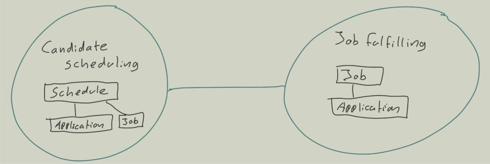

In their [research](https://www.nature.com/articles/s41586-021-03380-y) Gabrielle Adams and her collaborators explore what they call the ‘additive bias’ – our natural tendency to solve problems by adding elements, rather than considering the removal of existing ones. Their study investigates whether people are as likely to think about subtracting components from an object, idea, or situation as they are to consider adding new ones when facing a problem. For example, one of the tasks involved a small Lego structure with an unstable platform on top of a house. Participants were asked to modify the structure to support a heavy brick on the platform above a figurine’s head. They were given a dollar for this task and informed that adding bricks would cost them ten cents each.

The study divided participants into two groups. The first, a control group, was just given the assignment, while the second group was reminded that removing bricks was free. There were two basic solutions to the problem: either add three bricks to stabilise the structure or remove the one brick causing instability. The study found that participants were more likely to come up with the subtractive solution when they were reminded that removing bricks was free. This tendency to favour additive solutions was evident not only in this experiment but also in multiple studies within the research, showing its significant impact in organisational settings as well.

## How the bias towards additive impacts domain modelling

In software design, our aim is to address business challenges by developing software models and translating them into code. As Rebecca Wirfs-Brock insightfully puts it, a software model is “a simplified representation of a thing or phenomenon that intentionally emphasises certain aspects while ignoring others, a form of abstraction with a specific purpose.” To illustrate, consider the domain of a temping agency. Here, we have a recruiter looking to fill a specific job. For example, they need four individuals to work as delivery drivers next Monday from 4 pm to 10 pm. Candidates can apply for this job, allowing the recruiter to evaluate and select the best fits from potentially numerous applicants, say 20, for this single position. However, before applying, candidates must meet certain business requirements, such as having a driver’s licence for this role. We can encapsulate this scenario in a software model we might call “Job Fulfilling.”

> A model is a simplified representation of a thing or phenomenon that intentionally emphasises certain aspects while ignoring others. Abstraction with a specific use in mind. — Rebecca Wirfs-Brock

Furthermore, we have candidates who may apply for multiple jobs on the same day, increasing their chances of securing employment. A candidate might apply both as a delivery driver and for a position at a grocery store. Here, we face another business constraint: a candidate can only be accepted for one job at a time. Therefore, accepting a candidate for one job necessitates withdrawing their applications for other jobs during the same time frame. This scenario can be conceptualised in another software model named “Candidate Scheduling.” Importantly, these two models – “Job Fulfilling” and “Candidate Scheduling” – are interconnected through the candidate applications, as shown in the subsequent diagram:

When addressing the issue of a candidate accepting a job while having other active applications for the same time period, we might fall into the additive bias by incorporating this feature into the “Job Fulfilling” model. Since this model already handles applications, it seems logical to check there for any other applications the candidate might have and manage the process accordingly. This approach would entail adding the “candidate id” to the “application” within “Job Fulfilling” because we need to be able to find these other applications. However, it’s worth noting that including the candidate id in “Job Fulfilling” might not be necessary for the primary function of “Job Fulfilling.” This addition not only complicates the “Job Fulfilling” model but also creates a connascence of naming – a type of dependency – between “Candidate Scheduling” and “Job Fulfilling.” It effectively duplicates the business constraint from “Candidate Scheduling” into “Job Fulfilling,” increasing redundancy.

Moreover, if these two software models are managed by separate teams, this approach creates an additional layer of complexity. The coupling between the models translates into a possible need for increased communication and coordination between the two teams. This scenario highlights the potential pitfalls of automatically opting for additive solutions without considering the broader implications on system complexity and team dynamics.

## Lower the impact of subtraction neglect in software design

This example, while simple, highlights a common issue in software design. Initially, adding a single feature may not seem like a big deal, but as more features are added over time, the overall complexity of the model can increase significantly. This is a phenomenon known as ‘subtraction neglect,’ and it comes with serious consequences. It causes an increase in connascence, meaning there are more dependencies between different parts of the system, and heightened coupling. This can lead to a higher cost of change and potentially create less efficient software.

The impact of additive bias isn’t limited to just the structure of the software; it also affects the code we write. Think about your own coding practices: how often do you remove a significant amount of code rather than adding more to solve a problem? This approach is important not only in software design but in product design as well. Continuously adding new features without considering their necessity or overall impact can make a product more complicated and less user-friendly. Being aware of and actively countering this additive mindset is essential for creating software and products that are functional, straightforward, and user-friendly.

To reduce the impact of additive bias in software design, I use a specific strategy when working with teams. I encourage them to critically evaluate their software models by asking, “What can we remove from our software model?” This question aims to identify and eliminate any unnecessary concepts, language, objects, or elements, thereby simplifying the model.

> A model is done when nothing else can be taken out. — Freeman Dyson

However, it’s important to strike a balance. While simplifying the model is beneficial, over-simplification can lead to models that are too basic, potentially losing important details and concepts that are essential to the problem being addressed. The key is to maintain a model that is both simple and comprehensive enough to accurately represent the problem and its solution.

The effectiveness of a software model is reflected in how well it conveys the problem it’s designed to solve. The code and model should mirror the team’s communication and understanding, ensuring that the model is both functional and straightforward. By focusing on removing unnecessary complexity, we can create more efficient and user-friendly software.

This blog post was inspired by the Choiceology episode: [Less Is More: With Guests Ryan McFarland & Gabrielle Adams](https://www.schwab.com/learn/story/less-is-more-with-guests-ryan-mcfarland-gabrielle-adams)

You can read more about how cognitive bias impact software design in my co-authored book “[Collaborative Software design](https://weave-it.org/book-collaborative-software-design/)“.
