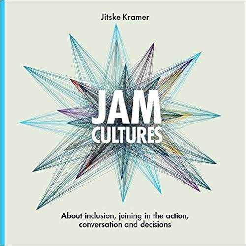

Collaborative modelling is not only an essential practice in Domain-Driven Design for creating a shared understanding of the domain. I believe it is vital in building sustainable and inclusive quality software. Covid-19 has constrained us to move collaborative modelling sessions online, and for almost everyone, this is uncharted territory and can be quite overwhelming. In these series of posts, I hope to give people some guidance and heuristics to start doing more of collaborative modelling in a remote world so that we can build more sustainable and inclusive quality software. We start this series with a practice that can make or break a collaborative modelling session, a Deep Democracy check-in.

<!--more-->

## What exactly is collaborative modelling?

Let us start with a small introduction to collaborative modelling. Collaborative modelling is a practice of using requirement analysis and modelling techniques to create a shared understanding. The traditional way of modelling involved a lot of hand-overs and writing diagrams and documentation for it. The problem here being that hand-overs cost time and diagrams and documentation are prune to assumptions due to cognitive biasses. As Ruth Malan says:

> We need to keep in mind, sketches and models are part of the learning mix (feedback loops). We want to explore and probe with the cheapest mode and medium that is good enough for the learning moment. Sketches/diagrams/models may be good enough. — VisArch (@ruthmalan) [March 20, 2019](https://twitter.com/ruthmalan/status/1108409076998959105?ref_src=twsrc%5Etfw)

So instead, we choose to do collaborative modelling to build and maintain a shared understanding of the problem space and the potential solution. Within Domain-Driven Design, we use a lot of lightweight collaborative modelling practices like EventStorming, Context Mapping, Example Mapping, Wardley mapping, and impact mapping (to name a few). The only challenge is, putting people in a room means putting all sorts of different ideas together, and this will cause hassle! Because listening to all ideas in a group usually goes okay (besides the point that we typically listen to react and not to understand). But how do we bring these ideas together and merge them?

> If you want to know more about visual and collaborative modelling look at Ruth Malan’s impressive [slides deck](https://www.slideshare.net/RufM/design-visualization-smoke-and-mirrors-slides-55822413) about Design Visualization: Smoke and Mirrors or my [talk](https://www.youtube.com/watch?v=5RrEzJM5bdw) Visual and Collaborative modelling at Domain-Driven Design Europe.

## Allowing all parts of the system to speak with Deep Democracy

I am a big fan of using Deep Democracy in my facilitation. Deep Democracy, coined by Arnold Mindell, has many layers, from deeply philosophical to practical. I use the Myrna Lewis method, which is a more practical framework for decision making. In essence, the **Democratic** part focuses on the assumption that all ideas are needed to make a quality and sustainable decision. Nothing put on the table is right or wrong, or as Arnold Mindell says:

> We must be able to identify all the parts in a system and allow them to speak. All the parts in a group, even those we do not like or believe to be useless, must be present and supported. — – Arnold Mindell

Diving into the “**Deep** part” means that we practically get in contact with deeper emotions at multiple levels of the group consciousness. It is in those multiple levels, where the wisdom and potential of the group can be found.   We will be diving into deep democracy the lewis method in a later post when we talk more about ranking, bias, truth, and decision making.

## Start identifying parts of a system with a check-in.

Always start a remote collaborative modelling session by setting the agenda, explaining the rules and what the potential outcomes are. This way, you make sure that people know why they are at the session. The first thing on the agenda of our collaborative modelling session is a check-in! In recent years multiple frameworks and approaches introduced a check-in, mostly to meet each other as persons and talk about how we are doing. The personal part is vital to see each other as more than their titles and hierarchical position like developers, testers, UX researchers, business, architects, chief etc. Behind those titles and positions, a lot of knowledge and wisdom has been gathered over the years: lessons from failures and concerns and desires. Just giving space to these knowledge assets, which are called roles in Deep Democracy, will make your decisions on the model richer and more sustainable.

if you’re in a hurry, take a detour! By [@frankweijers](https://twitter.com/frankweijers)   [https://www.spelenmetruimte.nl/frank-weijers/](https://www.spelenmetruimte.nl/frank-weijers/)

Another crucial part of check-ins is frequently overlooked: the relevance to the meeting. Ask yourself what conflict or polarisation does this group have? What has not been said in the group that is important? What stands in the way of freely discussing the topic we are about to collaborate on? We need to create and hold that space and safety for people to discuss these topics openly; otherwise, it will hold the group back. Eventually, it might even explode into a conflict, and that affects everyone and everything! So let’s get these matters out of the way by discussing them at the start of the meeting.

## Facilitating a remote collaborative modelling check-in

There are a few essential rules for a Deep Democracy check-in:

- Popcorn-style: We won’t be pointing fingers to specific people, or we won’t go around in a circle. Everyone does a check-in.

- Sharing & Dumping: It is a monologue; we do not react to other people.

- The facilitator begins. Lead by example and show a frame in how others can do their check-in.

- Everyone takes the time they need, knowing the time the meeting will take.

A remote check-in doesn’t differ a lot from the one in a physical meeting. However, there are some things to keep in mind, as they potentially influence a check-in: People tend to feel less safe in a remote setting. First of all, ask people if they can put their camera on at least during the check-in. Being able to see each other increases safety. As a facilitator, we can also see people’s reaction. I never demand people to put on their camera, because just by having it on, people might feel unsafe and that will influence the effectiveness of the check-in and the meeting. Even with a camera on, it is still an unsafe environment; we do not see what people are doing on the side, perhaps they are gossiping about other people through a chat on their machine. So keep that in mind, if there is conflict in the group you facilitate, the meeting and the conflict solving will take longer when done remotely. Make sure to pay attention to managing expectations. You don’t want conflict solving being interpreted as less effective and slowing down.

> Flow is important in a [#collaborativemodelling](https://twitter.com/hashtag/collaborativemodelling?src=hash&ref_src=twsrc%5Etfw) session. Equally important is chaos and conflict, which can give new insights. But in a [#remotework](https://twitter.com/hashtag/remotework?src=hash&ref_src=twsrc%5Etfw) world, structure is important to feel safe enough to share and have that conflict and chaos. [pic.twitter.com/5s7MQazKrI](https://t.co/5s7MQazKrI) — Kenny Baas-Schwegler (@kenny*baas) [November 9, 2020](https://twitter.com/kenny*baas/status/1325704067855814656?ref_src=twsrc%5Etfw)

## Visualise a remote collaborative modelling check-in

My favorite check-ins are face-to-face, the camera on, and everyone at least saying their name. It is much more personal to hear someone’s voice. However, in large groups, people might feel unsafe, having technical issues or are not in a situation at home to put the mic on or the camera. For these situations, we still want people to contribute to the check-in. So we advance the facilitation and combine the check-in for a remote collaborative modelling session with using visualisation techniques. Since we need to use a visual collaboration tool for doing these sessions remotely, it is simple to incorporate these in that tool and accommodate for it. My favourite one to start a workshop with is asking the attendees why they want to be here, and why not.

These techniques are also beneficial to let people get used to the visual collaboration tool; this way, people can start placing stickies and moving them around in the tool. As a facilitator, we start the check-in, so this way we also show how the tool works when we also share our screen. Once people put their stickies on the board, facilitators sum up the connection between the stickies and put opposites together in that sum-up. Once summed up, we asked if people want to react to anything that has been said or visualized. By creating space for that dialogue, we can start discussing potential conflicts that would otherwise pop-up during our session. Now we bring the conflict forward, which makes us go faster.

## Visual sense-making during remote collaborative modelling check-in

With a check-in, we make sure the group goes from orientation (why are we here) to trust-building (who is everyone in the session) and then moves towards goal clarification (what are we doing). In that goal clarification, it is important to make assumptions explicit, have clear, integrated goals, and create a shared vision about the collaborative modelling session. To further elicit, and engage in questioning to clarify that goal, we can also add some sensemaking techniques during our check-in. I picked up this technique from [Rebecca Wirfs-Brock ](http://www.wirfs-brock.com/)and [Ken Power](https://kenpower.ie/) during a decision making course in architecture. Sensemaking is the process by which people give meaning to the context, and the check-in I previously described was a great start to give sense to the context of the session, the goal. We use different kinds of visualisations where people can visualise where they stand in the context, like on a scale or a pyramid.

We asked attendees of a workshop on how they share knowledge in their current work. The blue dots represented their answer on the pyramid scale.

This sensemaking techniques give us as facilitators good insight into patterns that are present in the group. We can now discuss these patterns with the group, share and ask for observation of the outcomes. With sensemaking, we again further identify parts of a system.

## Feedback through a check-out

Similar to a check-in, we should always end a meeting with a check-out. The difference here is that with a check-in, we connect people, and in a check-out, we will allow people the opportunity to say the things they need to leave the session comfortably. Here we use the same techniques we used during the check-in. So for a sensemaking technique we used at the start, it will look like this.

Make sure you reconnect with the goal of the meeting, and if you want to follow up see what questions are still there. Just make sure we are not going back into decision making or a dialogue. The check-out let’s us share and dump what is needed to leave the session comfortably—any questions or concerns we can capture in a visualisation. We are a big fan of the “Wow and How About” training from the back of the room.

I hope these heuristics and structure will help you in your next visual collaborative modelling session. In this first part of the blog post about remote collaborative modelling check-in, we discussed the following heuristics:

- Always start with a check-in

- Ask relevant questions towards the session in a check-in

- Always end with a check-out

- Use visualisation for a remote check-in and check-out

- Use sensemaking for a remote check-in

In part 2 of these blog post series, I will talk about facilitation patterns to create flow during a collaborative modelling session, so stay tuned!

### Further reading

Kramer, Jitske (2019) Jam Cultures

Also, this post is published on the Xebia [blog site](https://xebia.com/blog/remote-collaborative-modelling-part-1-check-in/).
