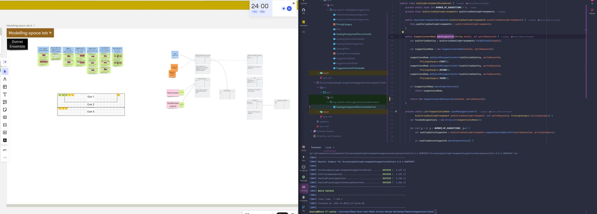

[<< Back to all workshops](https://weave-it.org/training/#workshops)

1 DAY WORKSHOP

## Applying Domain-Driven Design in Code

**Want to move beyond Domain-Driven Design theory and into real-world application?**

This “Applying Tactical Domain-Driven Design Patterns” workshop shows you how to build flexible, maintainable code that truly reflects your business needs. You’ll learn how to go from domain modeling to concrete Java or C# implementations, using Test-Driven Development (TDD) to ensure your code remains resilient and adaptable as your business evolves.

**Ready to start writing Domain-Driven Design in code?** Sign up for the “Applying Domain-Driven Design in Code” workshop and experience the power of DDD in action.<!-- notionvc: 1d8e7337-694a-44c3-ac7d-cfc67436f73e -->

#### This workshop is designed with software people in mind, namely ones involved in designing and writing software. Titles vary, but can fall under one of those:

- Software Developers & Engineers

- Software architect

- Solution, Enterprise or Domain Architects

- Engineering managers

#### Trainers

#### Kenny Baas-Schwegler

#### Bruno Boucard

### About the

### workshop

This hands-on workshop empowers developers to leverage the full potential of Domain-Driven Design (DDD) within their Java or C# code. Dive deep into the essential DDD tactical patterns, exploring entities, value objects, repositories, domain events, services, and aggregates. This intensive one-day course seamlessly blends theory and practice, guiding you from fundamental software design principles to advanced coding techniques. Enhance your learning with an optional pre-day session dedicated entirely to domain modeling using EventStorming and Example Mapping.

Throughout the workshop, you’ll transform the output of a domain modeling session into a software model. We’ll apply responsibility-driven development principles and utilize CRC cards collaboratively to ensure each potential class in our design has a clear purpose and definition. By fostering continuous collaboration with domain experts, we’ll maintain close alignment between code and model.

Guided by the model whirlpool method, we’ll navigate from defining bounded contexts to implementing tactical patterns with Test-Driven Development (TDD) in Java or C#. Upon completion, you’ll have gained practical experience coding with advanced DDD patterns and cultivated a mindset for tackling complex design challenges in a maintainable and scalable manner.

### What you will learn

- **Implement DDD Tactical Patterns:** Gain an in-depth understanding of DDD’s tactical patterns and how to effectively implement them in Java or C# to create robust, business-focused software solutions.

- **Code with Confidence:** Write code examples for entities, value objects, repositories, domain events, services, and aggregates, learning how these elements interconnect to form a cohesive and effective model.

- **Collaborative Modeling in Action:** Translate the outcomes of EventStorming and Example Mapping domain modeling sessions into a practical object-oriented software model ready for development.

- **Responsibility-Driven Design:** Practice responsibility-driven development principles, utilizing CRC cards to distribute responsibilities across your model for enhanced clarity and maintainability.

- **Iterative Refinement:** Understand the model whirlpool exploration process to iteratively refine your design and ensure continuous alignment with evolving business needs throughout the coding process.

- **TDD for DDD:** Apply Test-Driven Development (TDD) practices to strengthen your coding process, resulting in cleaner, more testable, and reliable code in Java or C#.

#### Before   the workshop

Prior experience in Domain-Driven Design is not a prerequisite for this workshop. You do need a few years experience writing C# or Java. To help lay the groundwork for the concepts we’ll explore, we provide an optional short introduction to Domain-Driven Design before the beginning of the workshop. This preparatory material is designed to prime your understanding and set you up for maximum benefit from the workshop’s content.

For participants keen on advanced preparation, we recommend delving into Vladik Khononov’s “Learning Domain-Driven Design.” This resource offers insightful, accessible guidance for those new to DDD. Additionally, Eric Evans’ book Domain-Driven Design: Tackling Complexity in the Heart of Software remains an invaluable read for anyone looking to deepen their understanding—a definite advantage for workshop participants.

Our workshop is highly interactive, designed to engage you in hands-on learning experiences. When conducted online, we utilise Miro, a versatile digital whiteboard tool, for our collaborative exercises. If you’re unfamiliar with Miro, we encourage you to take advantage of the self-paced participant onboarding course available at Miro Academy:[ Miro Participant Onboarding Course](https://academy.miro.com/courses/participant-onboarding). This short course will equip you with the navigational knowledge needed to fully participate in our interactive sessions.

[Follow me on socials]()

#### Contact
