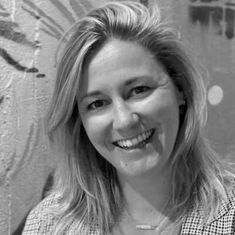

[<< Back to all workshops](https://weave-it.org/training/#workshops)

1 DAY WORKSHOP

## Disentangling Legacy Software with Domain-Driven Design

Coming soon

#### This workshop is designed for anyone who is involved in creating software:

- Software Developers & Engineers

- Solution & Enterprise Architects

- Product Managers, Owners & Business Analysts

- Engineering managers & Scrum Masters

- Anyone interested in mastering Domain-Driven Design to improve project outcomes and the software development process.

#### Trainers

#### Kenny Baas-Schwegler

#### Evelyn van kelle

#### Gien Verschatse

### About the

### workshop

Coming soon

Coming soon

### What you will learn

- **Coming soon

- **

#### Before   the workshop

Coming soon

Coming soon

[Follow me on socials]()

#### Contact
