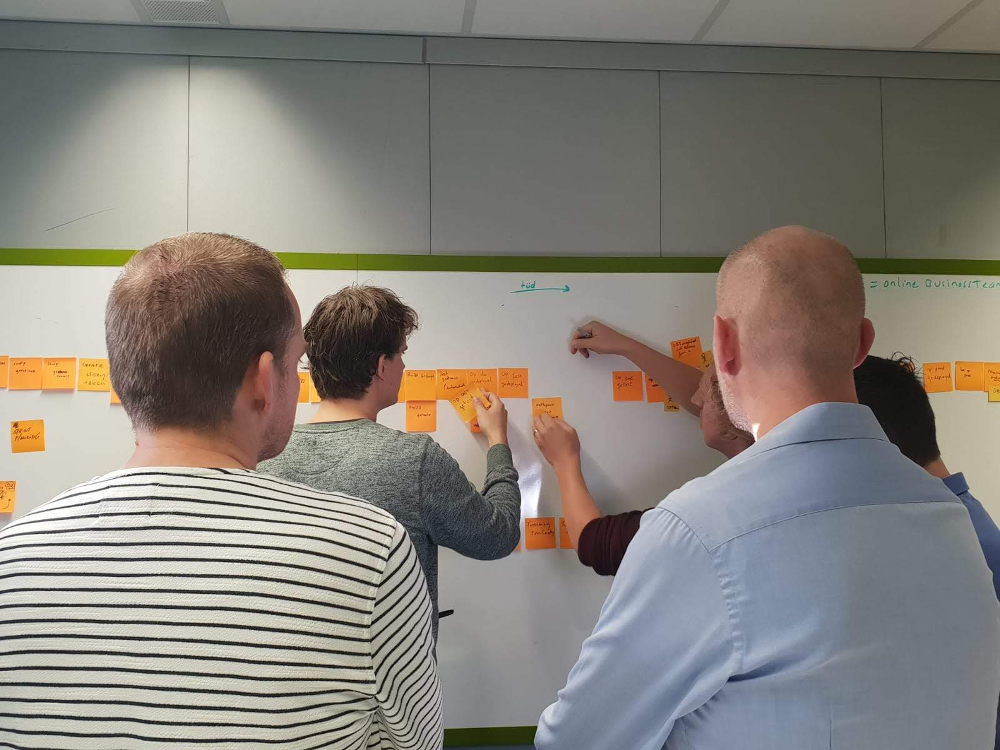

[<< Back to all workshops](https://weave-it.org/training/#workshops)

2 DAY WORKSHOP

## Domain-Driven Design for Software Architecture

Are you involved in software design and architecture? Do you want to ensure that they’re not only resilient and anti-fragile but also aligned with user and business needs? Are you keen to bridge the gap between software teams and stakeholders, fostering a collaborative environment that directly influences software design and architecture? If you’re looking to design software for complex problems, join our 2-day workshop titled “Domain-Driven Design for Software Architecture.” We’ll cover all these topics and more.

#### This workshop is designed with technical leadership people in mind, namely ones involved in software design and architecture. Titles vary but can fall under one of those:<!-- notionvc: 8c81c9ec-2270-46c9-ac27-31271ee8ebeb -->

- Software Developers & Engineers with 5 years of experience

- Tech Leads or Staff+

- Software, Solution, Enterprise or Domain Architects

- Engineering Managers

#### Trainers

#### Kenny Baas-Schwegler

#### João Rosa

### About the

### workshop

This hands-on 2-day workshop immerses you in the fundamentals of Domain-Driven Design, applying them directly to a real-world case study. We’ll explore cutting-edge advanced concepts like sociotechnical architecture and anti-fragile systems and their profound impact on the role of architecture in agile organisations.

You’ll gain unique perspectives and actionable insights through collaborative modelling techniques such as EventStorming, Wardley Mapping, Context Mapping, Domain Message Flow Modeling, and Core Domain Charts. We’ll delve into the intricacies of strategic Domain-Driven Design, utilising the basics of Team Topologies and residuality theory to critically assess trade-offs and balance inherent complexities within and across software systems and teams.

This workshop emphasises that Domain-Driven Design transcends technical skills and fosters an environment where software builders actively influence team structures and architectural choices. We’ll examine how technical leaders can guide and empower teams to align with organisational objectives. Our comprehensive approach integrates human factors with technical rigour, enabling teams to take ownership in designing and architecting their systems effectively.

### What you will learn

- **Foundational Principles of Domain-Driven Design:** This course explores the core concepts of Domain-Driven Design, establishing the essential knowledge base for modern software design.

- **Strategic Domain-Driven Design Patterns:** Explore context mapping in a practical way, employing strategic patterns crucial for creating an evolvable software architecture. Delve into the ‘Bounded Context’ pattern, a cornerstone for managing complexity and refining domain models.

- **Sociotechnical System Design:** Understand the vital role of sociotechnical system design in DDD. Acquire strategies to align software architecture with organisational structures, fostering synergy and continuous improvement.

-

- **Collaborative Modelling Techniques:** Use diverse collaborative modelling techniques, including EventStorming, Domain Message Flow Modeling, and Wardley Mapping, to gain a comprehensive understanding of the landscape and domains and facilitate effective teamwork.

- **Designing Antifragile Systems:** Gain an introduction to designing resilient bounded contexts using residuality theory and discover how Team Topology can help organise teams around these bounded contexts.

- **Empowering Teams in Software Design and Architecture:** Foster an environment where team members actively participate in and take ownership of the design and architecture of their software, cultivating commitment and a sense of responsibility.

#### Before the workshop

To maximise your experience in this workshop, a basic understanding of Domain-Driven Design is essential. To help lay the groundwork for the concepts we’ll explore, we provide an optional short introduction to Domain-Driven Design before the beginning of the workshop. This preparatory material is designed to prime your understanding and set you up for maximum benefit from the workshop’s content.

For participants keen on advanced preparation, we recommend delving into Vladik Khononov’s “Learning Domain-Driven Design.” This resource offers insightful, accessible guidance for those new to DDD. Additionally, Eric Evans’ book Domain-Driven Design: Tackling Complexity in the Heart of Software remains an invaluable read for anyone looking to deepen their understanding—a definite advantage for workshop participants.

This highly interactive workshop is designed to engage you in hands-on learning experiences. We utilise Miro, a versatile digital whiteboard tool, when conducted online, for our collaborative exercises. If you’re unfamiliar with Miro, we encourage you to use the self-paced participant onboarding course available at Miro Academy:[ Miro Participant Onboarding Course](https://academy.miro.com/courses/participant-onboarding). This short course will equip you with the navigational knowledge needed to participate in our interactive sessions fully.<!-- notionvc: 2f0bd36e-d8cb-4bab-9669-7ecfe0b55439 -->

[Follow me on socials]()

#### Contact
