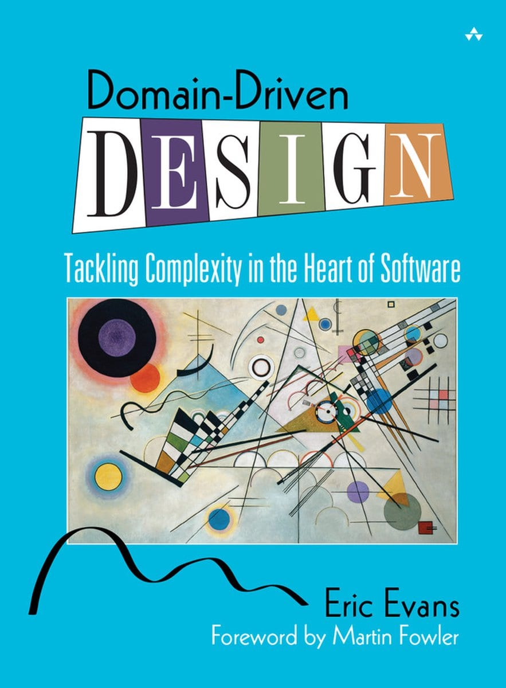
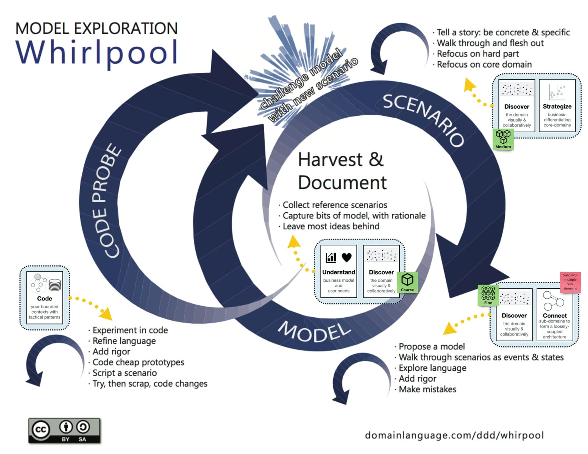
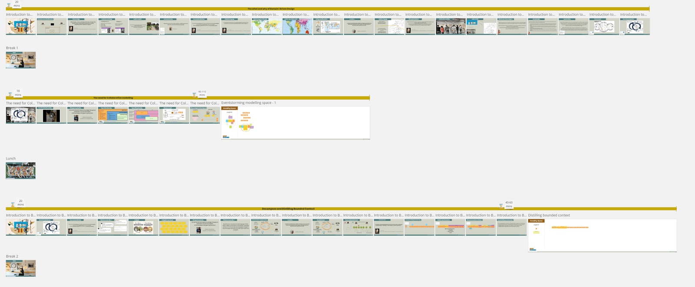

[<< Back to all workshops](https://weave-it.org/training/#workshops)

[Check Next public dates](https://connected-movement.com/en/course/domain-driven-design-voor-software-architectuur/)

2-days

## Domain-Driven Design for software teams

**Are you struggling to build software that truly adapts to your business needs while keeping your team aligned with stakeholders?**

A lot of knowledge is lost when designing and building software—lost because of handovers, confusing communication from lack of shared language, and not leveraging the full potential and wisdom of diverse perspectives. This lost knowledge impacts your ability to create software that remains adaptable as your business grows.

Domain-Driven Design offers a powerful way to address these challenges. By bringing stakeholders and development teams together to visualize and model software design decisions, we create a shared understanding that becomes the foundation for sustainable, resilient software.

**In this immersive 2-day workshop, you’ll learn how to apply Domain-Driven Design through collaborative modelling techniques that enable your team to work effectively with stakeholders.** We’ll explore the model discovery whirlpool—from understanding the problem space through EventStorming to defining clear bounded contexts with Context Mapping, all the way to being ready to code.

<!-- notionvc: 44eb8f3f-5e13-481d-bd5f-8b67bcb99210 -->

#### This workshop is ideal for anyone involved in creating and maintaining software who wants to improve how their team collaborates on design decisions:

- **Software Developers & Engineers** – Learn collaborative modeling techniques that improve how you work with stakeholders and design software

- **Software, Solution & Enterprise Architects** – Build foundation in DDD collaborative techniques (see our “Software Architecture” workshop for strategic DDD patterns)

- **Product Managers & Product Owners** – Discover how to bridge product vision and technical implementation (see our “Product Management” workshop for role-specific content)

- **Business Analysts & Quality Assurance Professionals** – Learn techniques for clearer requirements and better stakeholder collaboration

- **Engineering Managers & Scrum Masters** – Understand how to enable your team in collaborative design practices

- **Anyone interested in improving their team’s software design process through collaboration**

**This workshop provides foundational collaborative modeling skills valuable across all these roles. For specialized strategic content, see our advanced workshops in Software Architecture and Product Management.**

<!-- notionvc: ff227635-af34-4f3e-b709-019b82ab5f40 -->

#### Trainers

#### Kenny Baas-Schwegler

### About the

### workshop

Software systems are increasingly crucial to our organizations, yet building software that truly reflects business needs and adapts to change remains a significant challenge. The gap between what stakeholders envision and what gets built widens when teams focus on solutions before fully understanding the problems they’re trying to solve.

Training Approach: My training sessions are rooted in the “Training from the Back of the Room” and “Deep Democracy” methodology, emphasizing an immersive, hands-on experience. Approximately 80% of the content is practical and hands-on, ensuring you actively engage with techniques you can apply in your next design session.<!-- notionvc: 7e111590-f106-45f2-b671-6cc815b7518d -->

These collaborative modelling skills remain essential regardless of which development tools your team uses. As development automation continues to advance—including AI-assisted coding—the bottleneck shifts from writing code to understanding what to build. The fundamental challenge remains: building shared understanding of the problem, developing clear purpose for your software, and making strategic decisions about boundaries and integration. These are the human judgment and collaboration skills that enable teams to build the right software.

In this two-day hands-on training, we’ll work through a realistic use case together, using collaborative modelling techniques to bring Domain-Driven Design to life. Through EventStorming, we’ll explore the problem space and uncover the business needs that matter. Context Mapping will help us identify and define bounded contexts—the foundation for enabling teams to take ownership of business problems and design, build, and run their software independently.

You’ll experience first-hand how building a shared language between your team and stakeholders transforms both communication and decision-making. Domain Message Flow Modelling will introduce you to patterns for effective communication and integration between bounded contexts, giving you the tools to make informed decisions when designing distributed systems. Through Example Mapping, we’ll identify and refine acceptance criteria to ensure your bounded contexts deliver real value.

We’ll wrap up the training by connecting the dots, showing how these collaborative design sessions can lead to clear, maintainable code—even for those who don’t write code themselves.

### Program

#### **Day 1: Understanding the Problem Space**

**Module 1 – The What and Why of Domain-Driven Design**

- Check-in: Setting intentions and building connection

- Presentation: Why Domain-Driven Design matters for sustainable software

**Module 2 – Understanding the Problem with EventStorming**

- Break-out: Exploring how you currently tackle problem discovery

- Hands-on: Use EventStorming to model business processes and uncover the problem space together

- Dialogue: Making the implicit explicit through collaborative visualization

**Module 3 – Distilling Bounded Contexts**

- Hands-on: Use Context Mapping to distill bounded contexts from your EventStorming insights

- Presentation: The Bounded Context pattern and why it matters

- Hands-on: Define purpose, identify user needs, and develop a ubiquitous language

- Presentation: Reframing the problem we’re solving

#### **<!-- notionvc: aa8ec57d-bd30-49f5-aa65-46d65ae47c11 -->**

<!-- notionvc: c90b5dbd-2387-4e9c-8866-2f5c7c0d0746 -->

#### **Day 2: From Understanding to Implementation**

**Module 4 – Connecting Bounded Contexts**

- Presentation: Key strategic decisions that shape your overall design

- Break-out: Teach-back on strategic patterns to solidify understanding

- Hands-on: Model integration patterns using Domain Message Flow Modeling

- Dialogue: Navigating the trade-offs between single-context and multi-context solutions

**Module 5 – Making the Bounded Context Explicit**

- Dialogue: When should you apply DDD? Using Core Domain Charts to decide

- Hands-on: Make your bounded context concrete with the Bounded Context Canvas

- Hands-on: Use Example Mapping to define clear acceptance criteria

- Reflection: Ensuring your design delivers value

**Module 6 – Integrating DDD into Your Team Flow**

- Bonus Dialogue: Using Domain-Driven Design when surrounded by Legacy

- Ending Presentation: From collaborative design to code—how it all comes together

- Check-out: Reflect, share takeaways, and commit to next steps

<!-- notionvc: dc33b4ec-64fd-4121-a919-ca5f51721821 -->

<!-- notionvc: 9c9a1cb6-4830-4a05-87c2-d0de22919bd8 -->

### **What you will learn**

- **Build Shared Understanding Through Collaborative Modeling** Discover how EventStorming, Context Mapping, Domain Message Flow Modeling, and Example Mapping create shared understanding between developers and stakeholders. You’ll learn how building a ubiquitous language—a common vocabulary that bridges business and technical perspectives—eliminates miscommunication and enables teams to design software that truly solves business problems. This shared understanding becomes essential when using AI coding assistants: to generate code that solves actual user problems, AI needs clear context about what to build—context that emerges from collaborative modeling, not from prompts alone.

- **Identify and Define Bounded Contexts** Learn to recognize subdomains within your business domain and distill them into clear bounded contexts. Through hands-on exercises, you’ll develop boundaries that enable teams to take ownership of complete business problems and work independently while maintaining system coherence.

- **Navigate Strategic Design Decisions** Explore how context mapping patterns influence your overall architecture and work through trade-offs between different integration approaches. You’ll practice making decisions about whether to solve challenges within a single context or across multiple contexts, understanding the implications of each choice.

- **Make Your Design Explicit and Actionable** Use the Bounded Context Canvas to make each context’s purpose explicit and Example Mapping to define clear acceptance criteria. You’ll leave with practical tools for documenting your architecture and ensuring your design delivers real value.

<!-- notionvc: c97ce555-653c-4692-9867-445ce66b4885 -->

### **After This Training**

You’ll be able to:

- Facilitate EventStorming sessions to explore problem spaces collaboratively with stakeholders

- Use Context Mapping to identify and visualize bounded contexts and their relationships

- Develop a ubiquitous language that eliminates miscommunication between business and technical perspectives

- Apply Domain Message Flow Modelling to design integration patterns between bounded contexts

- Use Example Mapping to define clear, unambiguous acceptance criteria

- Apply the Bounded Context Canvas to make each context’s purpose and ownership explicit

- Integrate DDD collaborative techniques into your team’s existing workflow

- Provide clear context for development—whether manual coding or AI-assisted—through shared understanding of problems and purpose

- Connect collaborative design sessions to working code implementation

<!-- notionvc: b2c5da07-c1d3-4a0f-b625-a96d21c480ed -->

#### Before

the workshop

Prior experience in Domain-Driven Design is not required for this workshop. To help lay the groundwork, we provide an optional short introduction to Domain-Driven Design concepts before the workshop begins. This preparatory material will prime your understanding and maximize the benefit you gain from the hands-on sessions.

**Recommended Reading:**

For those who want to prepare more deeply, we recommend:

- **“Learning Domain-Driven Design” by Vladik Khononov** – Accessible and insightful for those new to DDD

- **“Domain-Driven Design: Tackling Complexity in the Heart of Software” by Eric Evans** – The foundational text that remains invaluable for anyone wanting deeper understanding

**Workshop Tools:**

This highly interactive workshop engages you in hands-on learning experiences without the need of any laptop. Everything is presented from Miro which at the end you will get a copy of as PDF. When conducted online, we use Miro, a versatile digital whiteboard tool, for our collaborative exercises. If you’re unfamiliar with Miro, we encourage you to complete the participant onboarding course at [Miro Academy](https://academy.miro.com/courses/participant-onboarding) to be fully prepared for our interactive sessions.

<!-- notionvc: 6f99a4f4-ab28-427f-a921-519001eb3c77 -->

[Follow me on socials]()

#### Contact
