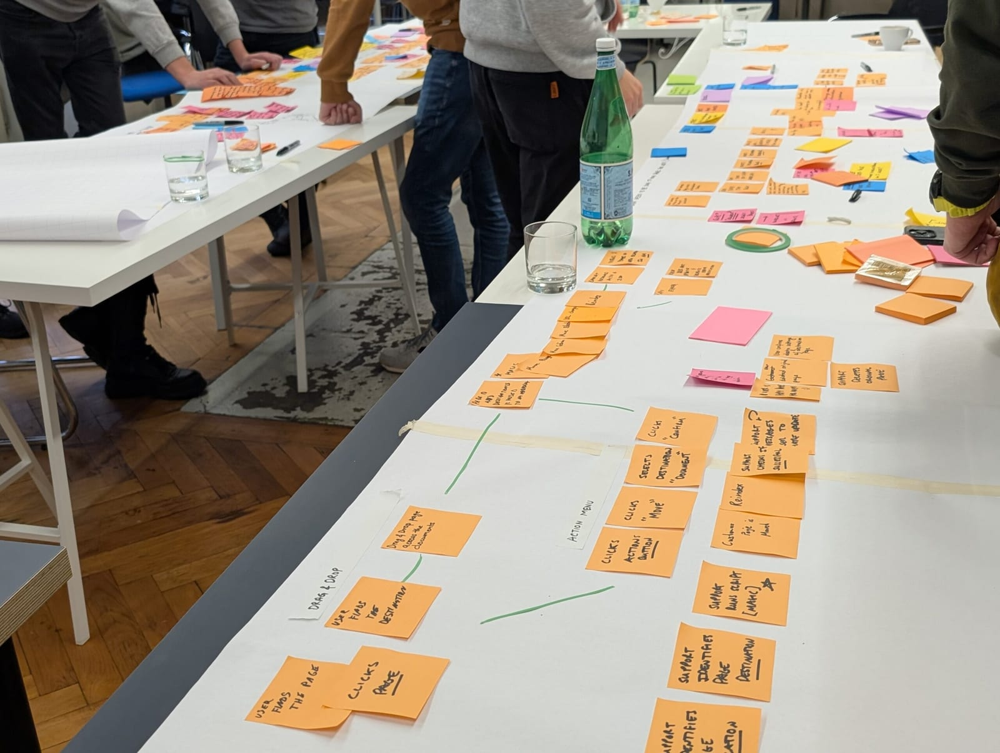

[<< Back to all workshops](https://weave-it.org/training/#workshops)

[Check next public date](https://connected-movement.com/en/course/domain-driven-design-voor-product-management/)

2-DAYS

## Domain-Driven Design for Product Management

**Are you tired of watching your product vision get lost in translation between stakeholders and engineering?**

You spend weeks aligning stakeholders on strategy. You define the roadmap. Engineering starts building. Suddenly you’re in the weeds answering questions about edge cases and data models. The feature ships, but it doesn’t quite solve the user problem you identified. Your roadmap slips. Again.

The challenge isn’t lazy developers or unclear requirements—it’s that product strategy and technical implementation speak fundamentally different languages. You think in user problems and market opportunities. Engineering thinks in systems and services. Without a shared way to bridge these perspectives, critical product decisions get made by whoever’s closest to the code.

**In this hands-on 2-day workshop, you’ll learn how to maintain your product vision through implementation.** You’ll work through realistic scenarios to build a shared language with engineering, define product boundaries that align with how users actually experience value, and make strategic decisions about where to invest effort. You’ll leave with practical techniques to ensure what ships matches what you envisioned—without micromanaging engineering.

<!-- notionvc: 56a66686-428b-475c-b3c8-43cdca969589 -->

This workshop is ideal for anyone involved in product management and product development who wants to improve collaboration between product and engineering:

- **Product Managers & Product Owners** responsible for defining what gets built

- **VP of Engineering & Engineering Managers** who need to align product vision with technical implementation

- **User Experience Designers & Product Designers** involved in understanding user needs and defining features

- **Business Analysts** who bridge requirements between business stakeholders and development teams

- **Founders & Startup Leaders** wearing both product and technical hats

You don’t need technical or coding experience—this workshop is designed specifically for product-focused roles who want to collaborate more effectively with development teams.

<!-- notionvc: 2b0fec5a-5264-4033-804e-590f9b511c2f -->

#### Trainers

#### Kenny Baas-Schwegler

### About the

### workshop

Many product managers view software architecture as a technical concern, something strictly for the developers. Yet the boundaries of a software system are often defined by business decisions and language, not just code.

**Training Approach:**

My training sessions are rooted in the “Training from the Back of the Room” and “Deep Democracy” methodology, emphasizing an immersive, hands-on experience. Approximately 80% of the content is practical and hands-on, ensuring you actively engage with techniques you can apply in your next product planning session.

<!-- notionvc: 54bc1d8f-7712-4dd4-8049-63fc51f97ea2 -->

**Designing this shared context—actively lowering cognitive load and removing blockers to flow—is a core responsibility of the product manager.** The way you structure your product, which features bundle together, how you organize teams, where you draw boundaries between capabilities—this *is* architecture. When product and engineering don’t collaborate on these decisions, you get products that are hard to evolve, teams that can’t move independently, and roadmaps that constantly slip.

This matters regardless of which development tools your team uses. As development automation advances—including AI-assisted coding—the bottleneck shifts from writing code to understanding what to build. Translating product vision into working software requires shared understanding of user problems and clear purpose for each capability. This understanding emerges from collaborative work between product and engineering—not from better tools, clearer documentation, or more detailed specifications.

This workshop teaches you how to actively design that shared context. You’ll learn collaborative techniques to:

- Visualize how users experience your product and where natural boundaries exist

- Make strategic decisions about which capabilities differentiate your product (and which don’t)

- Define product structure and team organization so work flows without constant dependencies

- Bridge the gap between “what users need” and “how we’ll build it” in ways that maintain clarity as your product evolves

This is not a lecture. You’ll work hands-on through a realistic product case: mapping user journeys, identifying strategic capabilities, defining clear boundaries, and organizing for delivery. You’ll leave with techniques you can apply to your actual product the next working day.

<!-- notionvc: 69479819-4d35-4a68-8f20-9a3f188b8abf -->

<!-- notionvc: fd7464c2-23ab-4467-bceb-4e7d537bf6e1 -->

### What you will learn

### **What you will learn**

- **Design the Shared Context That Enables Team Flow** Learn how actively designing shared context is a core responsibility of the product manager. You’ll discover how lowering cognitive load through clear product boundaries and shared language removes blockers to flow, enabling teams to move faster. This clear context becomes essential when teams use AI coding assistants: to make AI generate software that solves real user problems, teams need shared understanding of those problems and clear purpose for features—understanding that comes from collaborative product work, not from better prompting.

- **Bridge Product Vision and Technical Implementation** Develop a ubiquitous language that connects your product strategy to how engineering talks about implementation. Through collaborative exercises using EventStorming and Context Mapping, you’ll experience how this eliminates the translation gap that causes requirements to get misunderstood and features to miss the mark.

- **Identify Natural Product Boundaries** Learn to recognize where product boundaries naturally emerge based on how users experience value. Through hands-on exercises mapping user journeys, you’ll discover how to structure your product so teams can own complete capabilities rather than fragmented features, becoming the foundation for team autonomy and fast delivery.

- **Make Strategic Product Investment Decisions** Use Core Domain Charts to identify which product capabilities create competitive differentiation versus which are commodity. You’ll practice making trade-offs between features, understanding where to invest product and engineering effort for maximum impact while organizing teams for autonomous delivery.

<!-- notionvc: 6d0bf9bd-baea-4b25-842e-33df0a417a4f -->

### **After This Training**

You’ll be able to:

- Run EventStorming sessions to map user journeys and business processes collaboratively with stakeholders and developers

- Apply Context Mapping to identify natural product boundaries based on how users experience value

- Develop a ubiquitous language that bridges product strategy and technical implementation

- Make strategic product decisions using Core Domain Charts to identify differentiation vs. commodity capabilities

- Organize teams around user needs using User Needs Mapping and Team Topologies thinking

- Define clear acceptance criteria using Example Mapping that developers readily understand

- Evaluate whether product boundaries enable team autonomy or create hidden dependencies

- Integrate collaborative modelling techniques into your existing product development workflow

- Provide clear product context that enables effective development—whether teams code manually or use AI assistants—through shared understanding of user needs and feature purpose

- Maintain product vision and strategic coherence as products evolve and teams scale

<!-- notionvc: ce909888-ed14-4169-9bf0-9cfcb8ca54d1 -->

<!-- notionvc: ce909888-ed14-4169-9bf0-9cfcb8ca54d1 -->

#### Before   the workshop

Prior experience in Domain-Driven Design is not required for this workshop. To help lay the groundwork, we provide an optional short introduction to Domain-Driven Design concepts before the workshop begins. This preparatory material will prime your understanding and maximize the benefit you gain from the hands-on sessions.

**Recommended Reading:**

For those who want to prepare more deeply, we recommend:

- **“Learning Domain-Driven Design” by Vladik Khononov** – Accessible and insightful for those new to DDD

- **“Domain-Driven Design: Tackling Complexity in the Heart of Software” by Eric Evans** – The foundational text that remains invaluable for anyone wanting deeper understanding

**Workshop Tools:**

This highly interactive workshop engages you in hands-on learning experiences without the need of any laptop. Everything is presented from Miro which at the end you will get a copy of as PDF. When conducted online, we use Miro, a versatile digital whiteboard tool, for our collaborative exercises. If you’re unfamiliar with Miro, we encourage you to complete the participant onboarding course at [Miro Academy](https://academy.miro.com/courses/participant-onboarding) to be fully prepared for our interactive sessions.

<!-- notionvc: 08410dc6-184f-470c-9e8d-c1efe9de4cbc -->

[Follow me on socials]()

#### Contact
