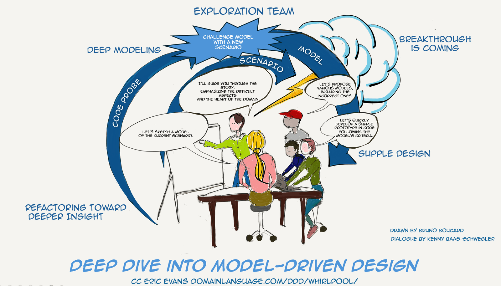

[<< Back to all workshops](https://weave-it.org/training/#workshops)

2 DAY WORKSHOP

## Deep Dive into Model-Driven Design

#### Refining Domain Models in Code

Have you implemented a software model but find yourself uncertain about how to refine it with new business constraints effectively? Are you grappling with an initial domain model that, amidst changing business landscapes, seems more like an impediment than a help? Do you notice a growing disconnect between your code and the intricate complexities of your domain, as well as the core domain concepts?

Embark on a journey with ‘Deep Dive into Model-Driven Design: Refining Domain Models in Code,’ an intensive workshop that immerses Java and C# developers in the transformative process of Eric Evans’s modeling whirlpool.   This workshop is not just an exploration but a deep dive into Part III of Evans’s groundbreaking work on Domain-Driven Design (DDD), specifically designed for those looking to advance beyond basic concepts like aggregates, entities, and value objects.

#### The workshop’s language will be either Java or C#, and it’s aimed at Software Developers & Engineers with at least five years of experience.

- Tech Leads

- Software or Solution Architects

- Engineering Managers

- Staff engineers.

#### Trainers

#### Kenny Baas-Schwegler

#### Bruno Boucard

### About the

### workshop

Dive deep into the complexities of Model-Driven Design and discover practical strategies beyond simple solutions to refine your Domain Model in Code. This approach guides you in developing a resilient, supple design that not only captures the true intricacies of your domain but also catalyzes significant breakthroughs in product development.

[Click here for the next public iteration](https://www.avanscoperta.it/en/training/deep-dive-into-model-driven-design-workshop/)

Recognizing that many projects begin with simplistic models which later become limiting as complexity grows, this workshop starts with a Bounded Context derived from an EventStorming exercise.Participants will engage in Example Mapping and CRC-cards sessions to formalize acceptance criteria, sketching a ‘naive’ domain model for our defined bounded context. This serves as a launchpad for practical, hands-on coding experiences, where acceptance criteria guide Test-Driven Development (TDD) exercises in both C# and Java.

Through iterative refinement with new, unexpected requirements, participants will demystify the concepts of supple design and deep modeling. The workshop reveals practical strategies for ‘designing by coding,’ ensuring that code remains in alignment with the changing domain model. Attendees will not only learn to harness the full potential of Domain-Driven Design and Model-Driven Design but also develop the skills to become domain experts as developers, and be able to start unlocking critical breakthroughs in product development.

### What you will learn

- **Refining Software Models**: Understand how you can include Design by coding in

- **Refining a basic domain model** to a complex, refined one that deeply resonates with the domain experts’ understanding.

- **Supple Design Principles**: Learn the principles of supple design and how they contribute to a more flexible and adaptive model.

- **Deep Modeling**: Accurately reflect the complex realities and rules of the domain in code

- **Refactoring to deeper insights**: Delve into the transformative concepts of chapter 13 from Eric Evans’s blue book, gaining insights that can be directly applied to your projects.

#### Before   the workshop

You should have at least five years of experience writing software using Java or C#. Additionally, it’s essential to have a background in working within a specific domain over some time. This includes experience with applying the bounded context pattern and implementing it through tactical patterns like aggregates, entities, value objects, and repositories, as well as maintaining these implementations.

Participants are expected to have a solid grasp of software design fundamentals, particularly those of Domain-Driven Design. This includes familiarity with key concepts like the bounded context pattern and basic patterns such as aggregates, entities, value objects, and repositories. Additionally, a foundational understanding of methodologies like EventStorming, example mapping, and Test-Driven Development will be beneficial.

If you have a computer/tablet, a stable connection (at least 20 Mbps in download and 10 Mbps in upload), earphones, a microphone, and a webcam, then you’re ready to join the workshop.You’ll get detailed information on what tools we’ll be using and how to get ready a couple of weeks prior to the workshop. Check out your connection’s speed. The workshop will keep its highly interactive and hands-on spirit despite being online. This is why we require that all participants keep their webcam on for the whole duration of the workshop: this will enhance the quality of the communication and of the workshop as a whole.

[Follow me on socials]()

#### Contact
