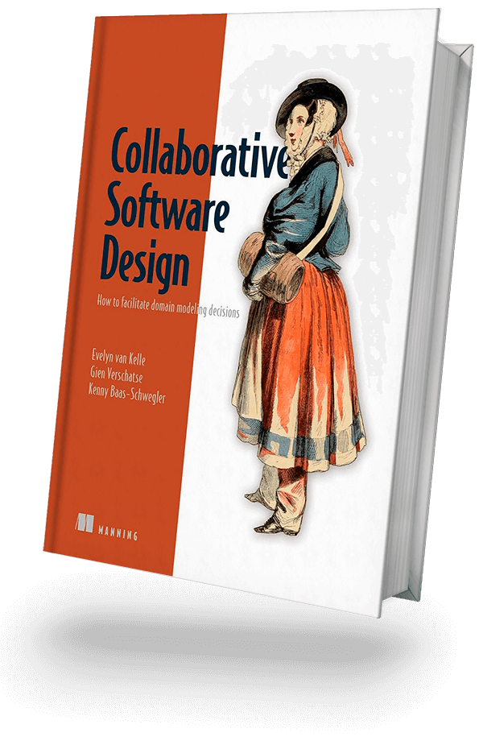
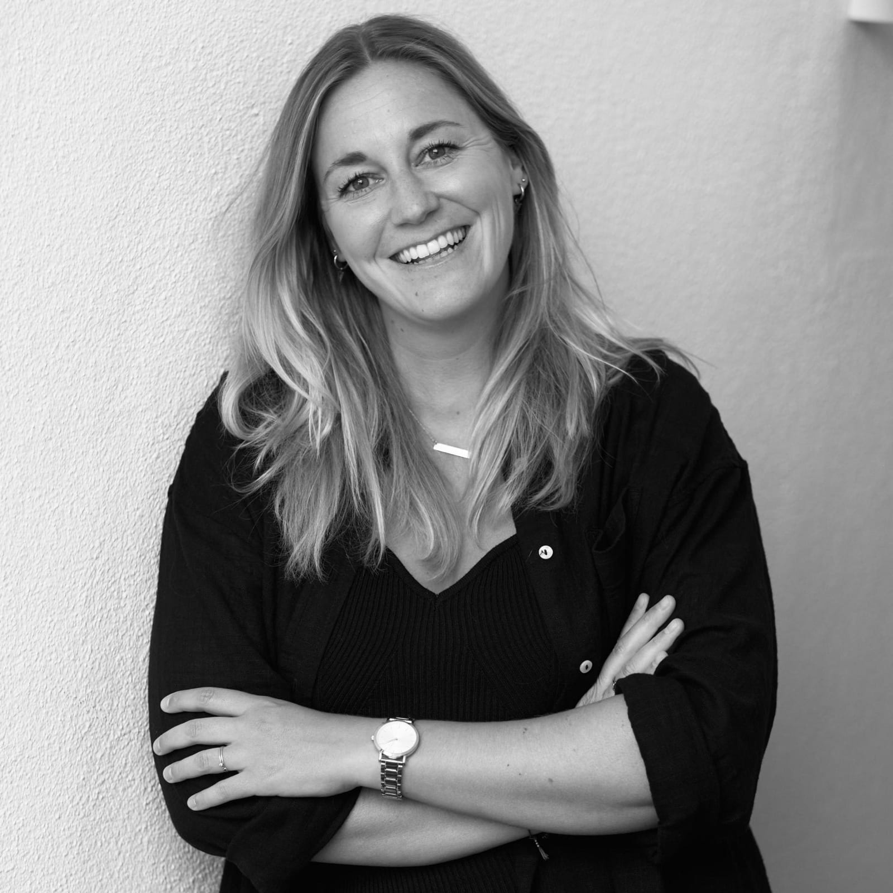
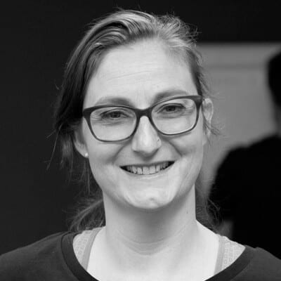

[<< Back to all workshops](https://weave-it.org/training/#workshops)

1 DAY WORKSHOP

## Navigating Conflicts in Software Architecture Decision Making

#### A Collaborative and Democratic Approach

Are you struggling with complex architectural decisions in software design? Ever faced a standstill due to differing opinions on architecture choices? Want to make decisions that everyone on the team can support and that align with both the technical and human needs of your projects? Join us in this 1-day expert deep dive workshop where you will learn to navigate conflicts in software architectural decision making.

#### This workshop is designed for anyone who is involved in creating and maintaining software:

- Software Developers & Engineers

- Software, Solution & Enterprise Architects

- Product Managers & Owners

- Business Analysts & Quality assurance roles

- Engineering managers & Scrum Masters

- Anyone interested in learning how to facilitate better decisions to improve their software design process.

#### Trainers

#### Kenny Baas-Schwegler

#### Evelyn van kelle

#### Gien Verschatse

### About the

### workshop

Software architecture forms the backbone to building successful software systems, but the decision-making process can be a hassle to navigate due to complexity and conflicts. These conflicts can originate from a lack of complete information to emotionally charged personal preferences, leading to decisions that may not fully align with the system’s overall objectives.

This misalignment can result in a less than ideal software architecture for the business and it also can leave the team members unhappy and resist the decision. Our goal should be to ensure decisions are sustainable – benefiting both the technical needs and the human needs involved.

Drawing from our co-authored book “Collaborative Software Design”, this concise one-day workshop is an expert deep dive focused on understanding conflict resolution during collaborative modelling and architectural decision-making and navigating them effectively. Within this interactive session, you will experience a democratic approach to resolving conflicts that often arise from the complex interplay of incomplete information, personal preference, and emotional charge.

### What you will learn

- **The significance of collaborative modeling** in effective communication and decision-making for sustainable software architecture.

- **Understanding the nature and impact of architectural decisions** on software development.

- **Insights into the common sources of conflict** in software architecture decision-making and their implications for system design.

- **An introduction to “role theory”** as advocated by Deep Democracy to foster inclusive and sustainable decision-making.

- **Hands-on strategies for managing disagreements** and integrating minority opinions to achieve a comprehensive, unified approach to architecture design.

#### Before   the workshop

To maximise your experience in this workshop, having done collaborative modelling before is useful. For those eager to advance their preparation, you can prepare by starting by reading our book on [Collaborative Software design](https://www.manning.com/books/collaborative-software-design/). Before the workshop we will provide you with some introduction material on what collaborative modelling is.

Our workshop is designed to be interactive, immersing you in hands-on learning. For online sessions, we utilize Miro, a digital whiteboard platform, for collaborative activities. If you’re not familiar with Miro, we recommend the self-paced Miro Academy: [Miro Participant Onboarding Course](https://academy.miro.com/courses/participant-onboarding). This brief course will give you the essential skills to actively engage in the workshop.

[Follow me on socials]()

#### Contact
