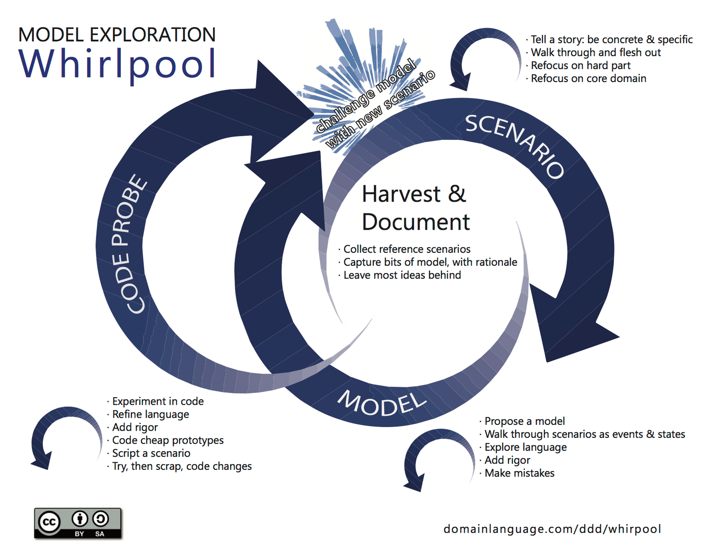

[<< Back to all learning journeys](https://weave-it.org/training/#learning-journeys)

2-5 DAY LEARNING JOURNEY

## Production-Ready Domain-Driven Design

#### With the Model Exploration Whirlpool

The essence of Domain-Driven Design is designing shared models between all disciplines involved in creating software. We should spend most of our effort on the part of the software that handles complex business requirements. We need to focus on a language where we really crisply concisely describe the situation in the domain, a shared language created through conversations between all disciplines involved.

Eric Evans wrote about the Model Exploration Whirlpool. It describes a process for exploring models. In this workshop, you will learn to use this process to go from exploring the problem space to probing a model in code, to deploying production-ready software.

The first 2-days are required, and you can optionally add the rest!

1 day

#### Domain-Driven Design for Software Teams

Start your explorative journey into Domain-Driven Design, discovering the benefits of collaborative domain modelling alongside stakeholders and software teams. We take the 1st day of this 2-day workshop to introduce the foundation of Domain-Driven Design with hands-on practical collaboration techniques such as EventStorming and Example Mapping.

[MORE INFO ABOUT THE FULL 2-DAYS >](https://weave-it.org/training/domain-driven-design-for-software-teams/)

1 day

#### Applying Domain-Driven Design in Code

During this workshop, we take the output from the domain modeling session from the first day,  and use it as a foundation for crafting our software model. We’ll apply responsibility-driven development principles and collaborate using CRC cards to ensure that each candidate class of our design is purposeful and clearly defined. By emphasizing continuous collaboration with domain experts, we maintain a strong alignment between code and model throughout the workshop. With the model whirlpool method as our compass, we chart a course from defining bounded contexts to implementing tactical patterns with Test-Driven Development (TDD) in Java or C#. By the conclusion, you’ll not only have coded with advanced DDD patterns but also developed a mindset for solving complex design challenges in a maintainable and scalable way.

**[MORE INFO >](https://weave-it.org/training/https://weave-it.org/training/applying-domain-driven-design-in-code/)**

1 Day

#### Deep Dive into Model-Driven Design: Refining Domain Models in Code

Embark on a journey with ‘Deep Dive into Model-Driven Design: Maturing Domain Models in Code,’ an intensive workshop that immerses Java and C# developers in the transformative process of Eric Evans’s modeling whirlpool. This workshop is not just an exploration but a deep dive into Part III of Evans’s groundbreaking work on Domain-Driven Design (DDD), specifically designed for those looking to advance beyond basic concepts like aggregates, entities, and value objects.

**[MORE INFO >](https://weave-it.org/training/model-driven-design-workshop/)**

1 Day

#### (Optional) Disentangling Legacy Software with Domain-Driven Design

Learn how to disentangle a legacy software systems and keep on releasing new features.

**More information soon!**

1 Day

#### (Optional) Designing Event-driven Architeture with Domain-Driven Design

Learn how to design an adaptable and scalable Event-Driven architecture with any messaging platform.

**More information soon!**

[Follow me on socials]()

#### Contact
